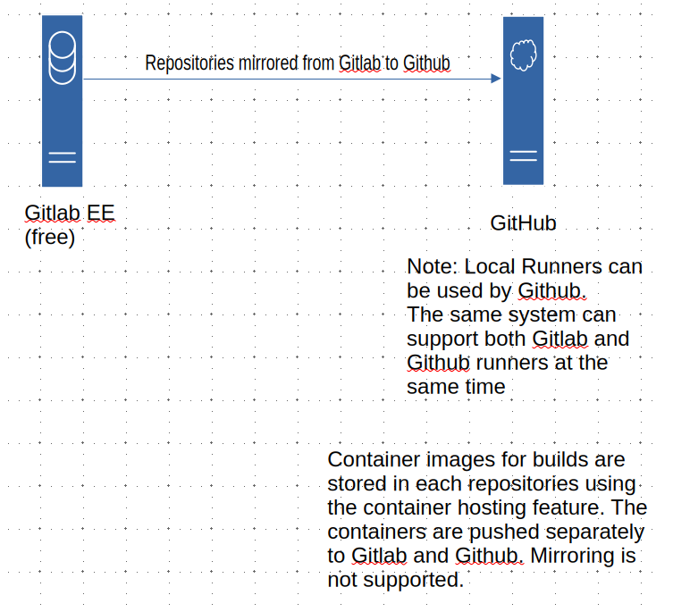
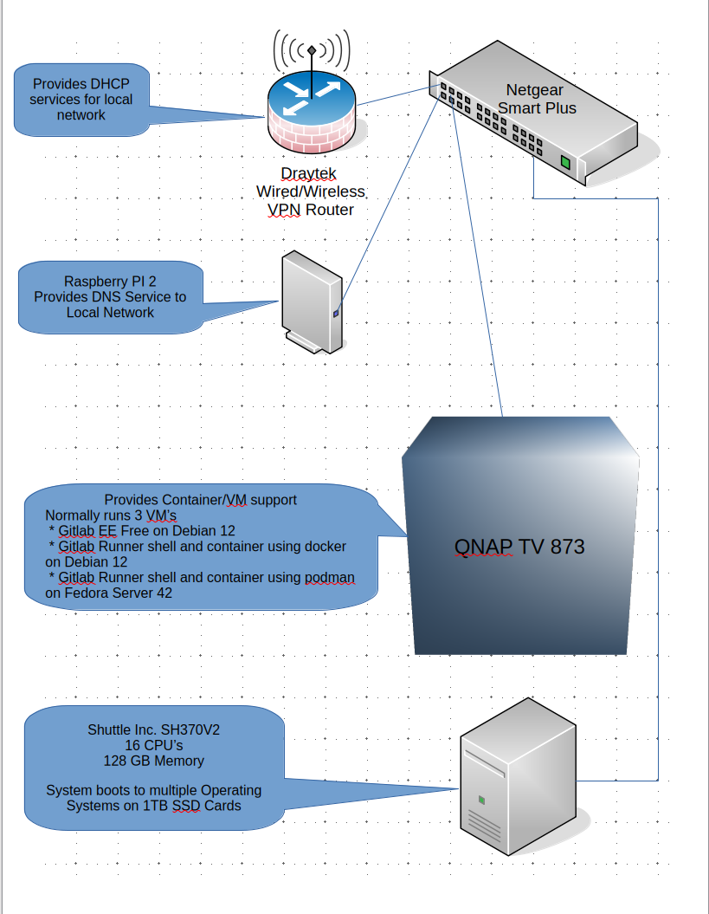

# softwaretrace-ostools #
Various Operating System tools. Contains both Library and Applications in multiple languages.

Doxygen Documentation located under doc

## Directory Structure ##

	 .
	 ├── build_containers     : files to support building containers for the ci/cd environment and testing.
	 ├── build_vms files      : to support building virtual machines for the ci/cd environment and testing.
	 ├── doc                  : documentation in pdf format.
	 ├── doc_md               : documentation in markdown format.
	 ├── images               : images/graphics used in documentation.
	 ├── libreoffice          : libreoffice files.
	 ├── local_repo_templates : repository templates configuration files for various operating systems.
	 ├── processmanagment     : process management examples.
	 └── system_management    : system management examples.

CI/CD pipelines:

	 ├── .github
	 ├── .gitlab-ci

Note: Graphics are drawn using Libre Office Draw.
The following extenstion is needed for some diagrams:

 [VRT Network Equipment](https://extensions.openoffice.org/en/project/vrt-network-equipment.html)

## Repository Setup ##

The primary repository is a gitlab free EE edition instance hosted on virtual machine in a home lab setup.
This repository and some others are automatically mirrored from the gitlab repositiory to github.

  

## HomeLab Enviroment ##

The home lab is primarily hosted on a QNAP TVS-873 system with various other sytems including:

  * Shuttle SH370V2 16 CPU 128 GB Memory
  * 2018 MacMini (Intel)
  * 2024 MacMini (M4)
  * multiple Raspberry Pi's v2, v4 and v5.

  Operating Systems used are:

  * ArchLinux 2025.08.01
  * Debain (Server and Workstation configurations)
  * Fedora (Server and Workstation configurations)
  * FreeBSD (Server and Workstation configuratins)
  * MacOS 26
  * RHEL Workstation
  * Ubuntu (Server and Workstation configurations)
  * Windows 11 Professional

  GCP, AWS and Azure accounts are also used.

  

### Gitlab Runners ###

 * Fedora 42 server VM shell and container (podman) runners 
 * Debian 12 server VM shell and container (docker) runners
 * Raspberry PI5 OS (Debian 12) shell
 * ArchLinux VM shell
 * ArchLinux as a container
 * RHEL 9 as a container
 * RHEL 9 Physical Machine shell and container (podman) runners.
 * FreeBSD 14 VM shell
 * MacOS 26 M4 shell
 * MacOS 15 Intel shell

### Gitlab Pipelines ###

Stages:

 * build_envs - builds the containers used by runners and uploads them to gitlab container repository.
 * lint       - lints the software. 
 * sanity     - runs sanity on multiple platforms.
 * package    - builds the packages for the demo applications.
 * publish    - pushes the packages out to local package repositories and updates the repository indexes.
